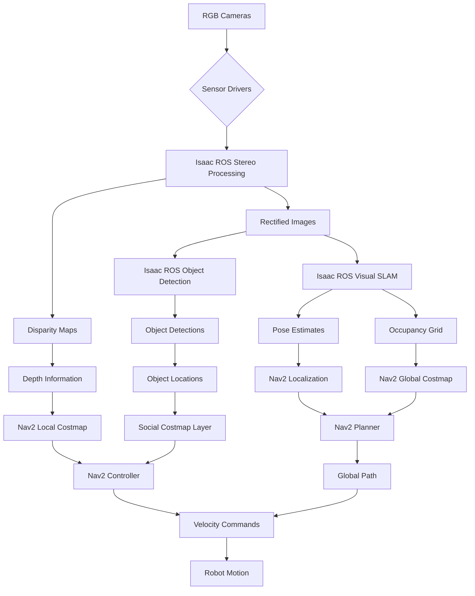
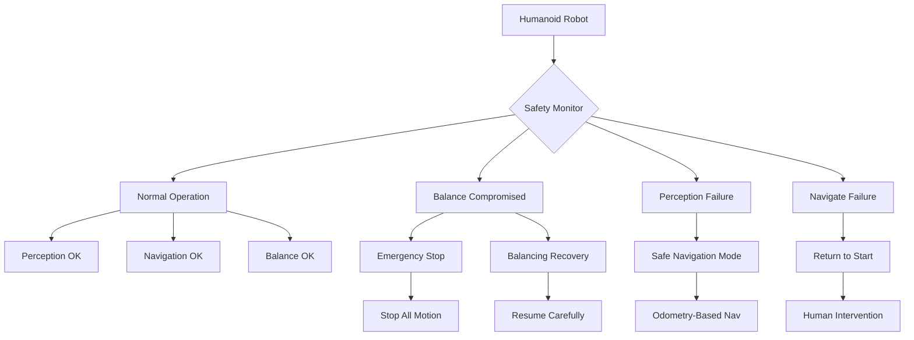

# Complete Integration Guide: AI-Robot Brain (NVIDIA Isaac™)

This comprehensive guide brings together all three chapters of the AI-Robot Brain module, showing how Isaac Sim, Isaac ROS, and Nav2 work together to create a complete AI-driven navigation system for humanoid robots.

## System Architecture Overview

### High-Level Architecture
```
┌─────────────────┐    ┌──────────────────┐    ┌─────────────────┐
│   Isaac Sim     │    │   Isaac ROS      │    │      Nav2       │
│  (Simulation)   │───▶│ (Perception &    │───▶│ (Navigation &   │
│                 │    │    SLAM)         │    │   Path Planning) │
└─────────────────┘    └──────────────────┘    └─────────────────┘
        │                       │                       │
        ▼                       ▼                       ▼
┌─────────────────┐    ┌──────────────────┐    ┌─────────────────┐
│ Synthetic Data  │    │  Environment     │    │ Safe Navigation │
│  Generation     │    │  Perception      │    │   Execution     │
└─────────────────┘    └──────────────────┘    └─────────────────┘
```

### Integration Points
1. **Isaac Sim → Isaac ROS**: Synthetic training data and simulation validation
2. **Isaac ROS → Nav2**: Perception data for obstacle detection and mapping
3. **Isaac Sim → Nav2**: Simulation environments for navigation testing

## Complete System Setup

### Prerequisites
Before integrating the complete system, ensure you have:

**Hardware Requirements**:
- NVIDIA GPU with compute capability 6.0+ (RTX series recommended)
- 16GB+ system RAM, 32GB+ for optimal performance
- Compatible humanoid robot with ROS2 support
- RGB-D cameras or stereo cameras for perception
- IMU for balance and localization

**Software Requirements**:
- ROS2 Humble Hawksbill
- Isaac Sim (Omniverse)
- Isaac ROS packages
- Nav2 packages
- CUDA toolkit and drivers
- Docker (for containerized deployment)

### Step-by-Step Integration Process

#### Phase 1: Environment Setup
1. **Install Isaac Sim**:
   - Download from NVIDIA Developer Zone
   - Install Omniverse launcher
   - Verify GPU compatibility and drivers

2. **Install Isaac ROS**:
   ```bash
   # Using Docker (recommended)
   docker pull nvcr.io/nvidia/isaac-ros/isaac_ros_visual_slam:latest
   docker pull nvcr.io/nvidia/isaac-ros/isaac_ros_stereo_dnn:latest
   ```

3. **Install Nav2**:
   ```bash
   sudo apt update
   sudo apt install ros-humble-navigation2 ros-humble-nav2-bringup
   ```

#### Phase 2: Individual Component Configuration
1. **Configure Isaac Sim** for your humanoid robot:
   - Import robot model (URDF/USD)
   - Set up sensors (cameras, IMU)
   - Configure physics properties
   - Create simulation environments

2. **Configure Isaac ROS** perception stack:
   - Set up camera calibration
   - Configure perception nodes
   - Optimize for robot hardware
   - Test individual components

3. **Configure Nav2** navigation stack:
   - Set up costmap parameters
   - Configure planners for humanoid constraints
   - Set up controller for bipedal motion
   - Test basic navigation

#### Phase 3: System Integration

### Complete Launch File
Create a launch file that brings up all integrated components:

```xml
<launch>
  <!-- Arguments -->
  <arg name="use_sim_time" default="false"/>
  <arg name="params_file" default="$(find-pkg-share your_robot_bringup)/config/nav2_params_humanoid.yaml"/>

  <!-- Isaac Sim Bridge (if using simulation) -->
  <group if="$(var use_sim_time)">
    <node pkg="isaac_ros_workspace" exec="isaac_sim_bridge" name="isaac_sim_bridge">
      <param name="use_sim_time" value="$(var use_sim_time)"/>
    </node>
  </group>

  <!-- Isaac ROS Perception Stack -->
  <group>
    <!-- Stereo rectification -->
    <node pkg="isaac_ros_stereo_image_proc" exec="stereo_image_rectify_node" name="stereo_rectify">
      <param name="approximate_sync" value="true"/>
      <param name="queue_size" value="1"/>
    </node>

    <!-- Disparity computation -->
    <node pkg="isaac_ros_stereo_image_proc" exec="disparity_node" name="disparity_node">
      <param name="approximate_sync" value="true"/>
      <param name="queue_size" value="1"/>
    </node>

    <!-- Visual SLAM -->
    <node pkg="isaac_ros_visual_slam" exec="isaac_ros_visual_slam_node" name="visual_slam">
      <param name="enable_occupancy_map" value="true"/>
      <param name="rectified_left_topic_name" value="/camera/left/image_rect_color"/>
      <param name="rectified_right_topic_name" value="/camera/right/image_rect_color"/>
      <param name="left_camera_info_topic_name" value="/camera/left/camera_info"/>
      <param name="right_camera_info_topic_name" value="/camera/right/camera_info"/>
      <param name="imu_topic_name" value="/imu/data"/>
    </node>

    <!-- Object detection -->
    <node pkg="isaac_ros_stereo_dnn" exec="isaac_ros_stereo_dnn" name="stereo_dnn">
      <param name="network_type" value="coco_tensorrt"/>
      <param name="input_topic_width" value="640"/>
      <param name="input_topic_height" value="480"/>
    </node>
  </group>

  <!-- Navigation Stack -->
  <group>
    <!-- Localization (AMCL) -->
    <node pkg="nav2_amcl" exec="amcl" name="amcl">
      <param from="$(var params_file)"/>
    </node>

    <!-- Map server -->
    <node pkg="nav2_map_server" exec="map_server" name="map_server">
      <param from="$(var params_file)"/>
    </node>

    <!-- Planner server -->
    <node pkg="nav2_planner" exec="planner_server" name="planner_server">
      <param from="$(var params_file)"/>
    </node>

    <!-- Controller server -->
    <node pkg="nav2_controller" exec="controller_server" name="controller_server">
      <param from="$(var params_file)"/>
    </node>

    <!-- Behavior tree navigator -->
    <node pkg="nav2_bt_navigator" exec="bt_navigator" name="bt_navigator">
      <param from="$(var params_file)"/>
    </node>

    <!-- Lifecycle manager -->
    <node pkg="nav2_lifecycle_manager" exec="lifecycle_manager" name="lifecycle_manager">
      <param name="use_sim_time" value="$(var use_sim_time)"/>
      <param name="autostart" value="true"/>
      <param name="node_names" value="[map_server, planner_server, controller_server, bt_navigator, amcl]"/>
    </node>
  </group>

  <!-- Visualization (RViz) -->
  <node pkg="rviz2" exec="rviz2" name="rviz2" args="-d $(find-pkg-share nav2_bringup)/rviz/nav2_namespaced_view.rviz">
    <param name="use_sim_time" value="$(var use_sim_time)"/>
  </node>
</launch>
```

## Data Flow and Integration

### Perception-to-Navigation Pipeline


### Real-time Integration Loop
The complete system operates in a coordinated real-time loop:

1. **Perception Cycle (20-30Hz)**:
   - Camera data acquisition
   - Stereo processing and depth estimation
   - Object detection and tracking
   - SLAM updates

2. **Planning Cycle (10Hz)**:
   - Global path planning
   - Path smoothing
   - Replanning when needed

3. **Control Cycle (20Hz)**:
   - Local path following
   - Obstacle avoidance
   - Velocity command generation

## Humanoid-Specific Integration

### Balance-Aware Navigation
The integrated system must maintain humanoid balance throughout navigation:

```python
# Example balance-aware navigation integration
class HumanoidIntegratedNavigator:
    def __init__(self):
        # Initialize Isaac ROS perception
        self.perception_client = self.create_client(PerceptionData, 'perception_data')

        # Initialize Nav2 navigation
        self.nav_client = ActionClient(self, NavigateToPose, 'navigate_to_pose')

        # Initialize balance monitoring
        self.balance_sub = self.create_subscription(BalanceState, 'balance_state', self.balance_callback)

        # State variables
        self.current_balance = 0.0
        self.balance_threshold = 0.15  # Safe balance threshold

    def navigate_with_balance_awareness(self, goal_pose):
        """Navigate while monitoring balance state"""
        while self.current_balance < self.balance_threshold:
            # Check if current path is balance-safe
            if self.is_path_balance_safe(goal_pose):
                # Send navigation goal
                self.send_navigation_goal(goal_pose)

                # Monitor balance during execution
                while self.navigation_active:
                    if self.current_balance > self.balance_threshold:
                        # Pause navigation for balance recovery
                        self.pause_navigation()
                        self.wait_for_balance_recovery()
            else:
                # Plan alternative balance-safe path
                safe_goal = self.find_balance_safe_alternative(goal_pose)
                self.send_navigation_goal(safe_goal)

    def is_path_balance_safe(self, goal_pose):
        """Check if path maintains balance constraints"""
        # Use Isaac ROS perception to analyze terrain
        terrain_analysis = self.get_terrain_analysis()

        # Check for steep slopes, obstacles that require imbalance
        return terrain_analysis.balance_score > 0.8
```

### Social Navigation Integration
Integrating human detection with navigation:

```yaml
# Complete integrated parameters
integrated_params:
  ros__parameters:
    # Isaac ROS perception parameters
    perception:
      human_detection:
        topic: "/isaac_ros/human_detections"
        confidence_threshold: 0.7
        tracking_enabled: true
        social_space_radius: 1.0

    # Nav2 social navigation parameters
    navigation:
      social_costmap:
        enabled: true
        personal_space_radius: 0.8
        social_space_radius: 1.2
        public_space_radius: 4.0
        human_inflation_weight: 2.0

    # Humanoid-specific parameters
    humanoid:
      step_constraints:
        max_step_height: 0.15
        max_step_width: 0.30
        max_step_length: 0.35
      balance_constraints:
        max_linear_speed: 0.4
        min_linear_speed: 0.1  # For balance maintenance
```

## Performance Optimization

### System-Level Optimization
1. **Resource Allocation**:
   - Assign dedicated CPU cores to perception and navigation
   - Configure GPU memory allocation for Isaac ROS
   - Set real-time priorities for critical processes

2. **Communication Optimization**:
   - Use shared memory for high-frequency data
   - Optimize QoS settings for real-time performance
   - Implement data compression where appropriate

3. **Processing Pipelines**:
   - Pipeline perception and navigation processing
   - Implement multi-threading for parallel operations
   - Use efficient data structures for real-time processing

### Load Balancing
```bash
# Example resource allocation script
#!/bin/bash

# Assign perception to CPU cores 2-3
taskset -c 2,3 ros2 run isaac_ros_visual_slam visual_slam_node &

# Assign navigation to CPU core 4
taskset -c 4 ros2 run nav2_controller controller_server &

# Assign main process to CPU core 1
taskset -c 1 ros2 launch your_integration_launch.py
```

## Safety and Fallback Systems

### Integrated Safety Architecture


### Fallback Strategies
1. **Perception Fallback**:
   - Switch to odometry-based navigation
   - Reduce speed for safety
   - Use alternative sensors if available

2. **Balance Fallback**:
   - Immediate stop if balance is critically compromised
   - Execute balance recovery procedures
   - Switch to stable pose if needed

3. **Navigation Fallback**:
   - Return to safe location
   - Request human assistance
   - Use simplified navigation modes

## Testing and Validation

### Integration Testing Protocol

#### Unit Integration Tests
1. **Perception-Navigation Interface**:
   - Test data format compatibility
   - Verify timing synchronization
   - Validate coordinate frame transformations

2. **Simulation-Reality Transfer**:
   - Compare simulation and real-world performance
   - Validate synthetic-to-real transfer
   - Test domain randomization effectiveness

#### System Integration Tests
1. **Complete Navigation Tasks**:
   - Start-to-finish navigation in various environments
   - Test with dynamic obstacles and humans
   - Validate safety and performance metrics

2. **Stress Testing**:
   - Long-duration navigation tests
   - High-traffic social navigation
   - Edge case scenarios

### Performance Metrics
Monitor these key metrics for the integrated system:

```python
# Example performance monitoring
class IntegrationPerformanceMonitor:
    def __init__(self):
        self.metrics = {
            'perception_latency': [],
            'navigation_success_rate': [],
            'balance_stability': [],
            'system_resource_usage': [],
            'human_interaction_success': []
        }

    def calculate_overall_performance(self):
        """Calculate integrated system performance score"""
        perception_score = self.calculate_perception_score()
        navigation_score = self.calculate_navigation_score()
        safety_score = self.calculate_safety_score()
        efficiency_score = self.calculate_efficiency_score()

        overall_score = (perception_score * 0.25 +
                        navigation_score * 0.35 +
                        safety_score * 0.25 +
                        efficiency_score * 0.15)

        return overall_score
```

## Troubleshooting Integrated Systems

### Common Integration Issues

#### Data Synchronization Problems
**Symptoms**: Perception data doesn't align with navigation commands
**Solutions**:
- Verify timestamp synchronization across all nodes
- Check TF tree for proper timing
- Adjust queue sizes for message synchronization

#### Resource Competition
**Symptoms**: System performance degrades when all components active
**Solutions**:
- Implement resource scheduling
- Optimize individual component performance
- Add hardware resources if needed

#### Coordinate Frame Issues
**Symptoms**: Navigation doesn't align with perceived environment
**Solutions**:
- Verify complete TF tree from camera to map
- Check sensor calibration
- Validate transform timing and accuracy

## Deployment Considerations

### Hardware Deployment
- **Edge Computing**: Use Jetson or similar platforms for robot deployment
- **Cloud Integration**: Offload heavy processing when connectivity allows
- **Redundancy**: Implement backup systems for critical functions

### Operational Deployment
- **Calibration**: Regular sensor and system calibration
- **Monitoring**: Continuous system health monitoring
- **Maintenance**: Scheduled maintenance and updates

## Best Practices for Complete Integration

### System Design
1. **Modular Architecture**: Keep components modular for independent testing
2. **Consistent Interfaces**: Use consistent data formats and APIs
3. **Error Handling**: Implement comprehensive error handling and recovery
4. **Safety First**: Design safety into every component and interaction

### Development Workflow
1. **Simulation First**: Develop and test in simulation before real robot
2. **Progressive Complexity**: Start simple, add complexity gradually
3. **Continuous Integration**: Regular testing of integrated system
4. **Documentation**: Maintain clear documentation of integration points

### Performance Monitoring
1. **Real-time Monitoring**: Monitor system performance during operation
2. **Predictive Maintenance**: Use metrics to predict system issues
3. **Adaptive Systems**: Implement systems that adapt to changing conditions
4. **Logging**: Comprehensive logging for debugging and analysis

## Next Steps

After implementing this complete integration guide:

1. **Advanced Features**: Add machine learning capabilities for improved navigation
2. **Multi-Robot Systems**: Extend to multiple robots with coordination
3. **Cloud Integration**: Connect to cloud services for enhanced capabilities
4. **Real-World Deployment**: Deploy in actual operational environments

This integration guide provides the foundation for building a complete AI-Robot Brain system that combines simulation, perception, and navigation for humanoid robots. The system can be extended and customized based on specific robot platforms and application requirements.